# プロジェクト処理フロー概要

## 1. アーキテクチャ概要

本プロジェクトは Next.js をベースとした多機能Webアプリケーションで、以下の主要な構成要素から成り立っています：

- **フロントエンド**: Next.js (App Router)
- **データベース**: Prisma ORM
- **認証**: NextAuth.js
- **UI**: React + TypeScript
- **スタイリング**: Tailwind CSS + SCSS

## 2. ディレクトリ構造と役割

### 2.1 コア処理ディレクトリ (`src/cm/`)

汎用性の高い共通処理が格納されています。

```
src/cm/
├── class/          # ユーティリティクラス群
├── components/     # 共通コンポーネント
├── hooks/          # カスタムフック群
├── lib/            # ライブラリ関数
├── types/          # 型定義
├── constants/      # 定数定義
├── providers/      # コンテキストプロバイダー
└── styles/         # スタイル定義
```

### 2.2 非共通処理ディレクトリ (`src/non-common/`)

プロジェクト固有の処理が格納されています。

```
src/non-common/
├── getPages/       # ページ定義取得
├── scope-lib/      # スコープ管理
├── (chains)/       # 処理チェーン
└── EsCollection/   # データコレクション
```

## 3. リクエスト処理フロー

### 3.1 ミドルウェア処理 (`src/middleware.ts`)

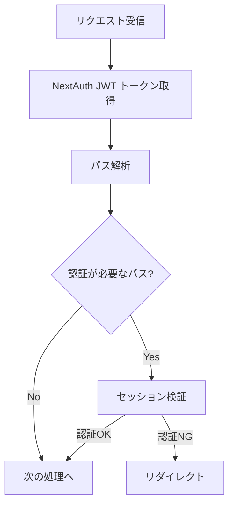

**主要機能:**

- パスベースの認証制御
- アプリケーション別のアクセス制御
- セッション検証とリダイレクト処理

### 3.2 認証フロー (`src/app/api/auth/`)

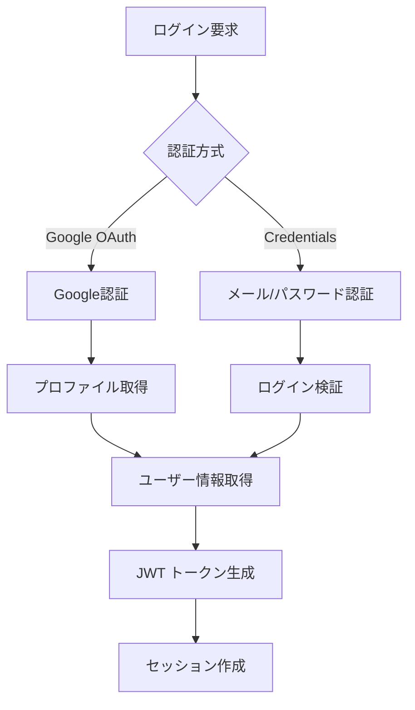

**主要機能:**

- Google OAuth 認証
- 認証情報による認証
- JWT トークン管理
- セッション管理

## 4. データ処理フロー

### 4.1 Prisma データアクセス層

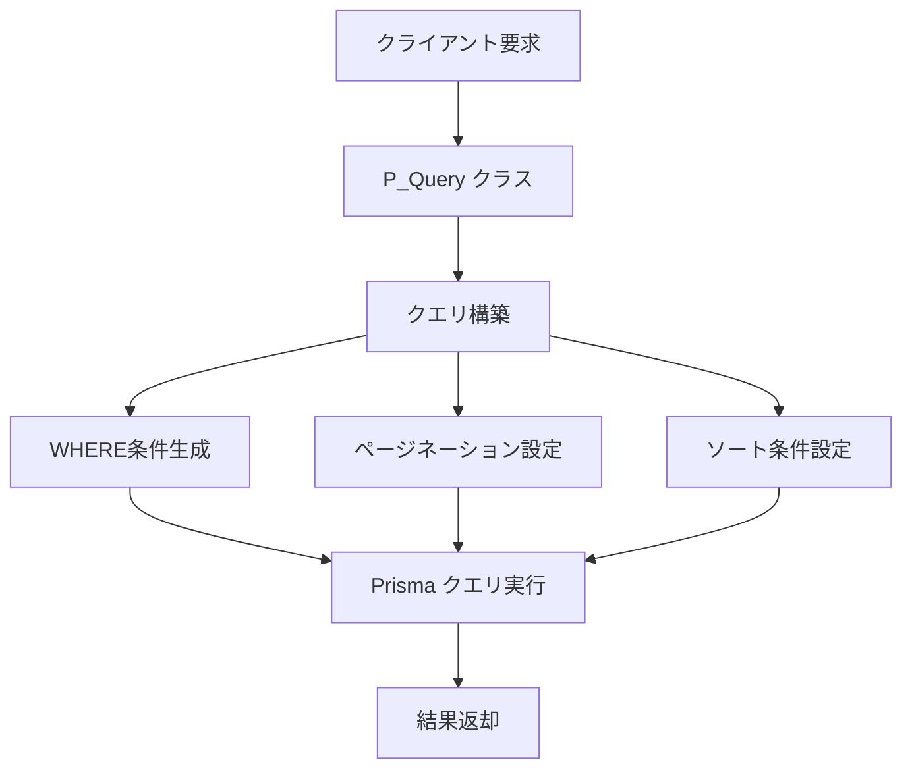

**P_Query クラスの主要機能:**

- 動的WHERE条件生成
- ページネーション処理
- ソート処理
- リレーション処理

### 4.2 サーバーサイド処理 (`src/non-common/serverSideFunction.tsx`)

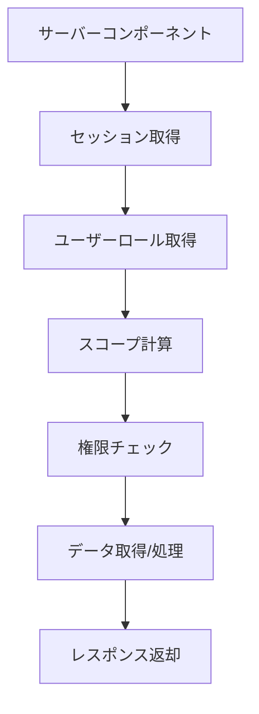

**主要機能:**

- サーバーサイドセッション管理
- ユーザーロール・権限管理
- ファイル処理
- API アクセス制御

## 5. UI コンポーネント処理フロー

### 5.1 MyTable コンポーネント (`src/cm/components/DataLogic/TFs/MyTable/`)

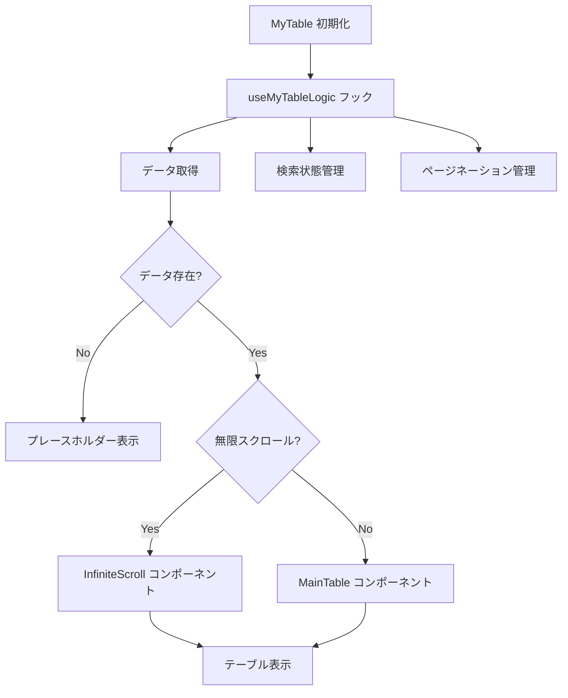

**主要機能:**

- データテーブル表示
- 検索・フィルタリング
- ページネーション
- 無限スクロール
- ソート機能

### 5.2 MyForm コンポーネント (`src/cm/components/DataLogic/TFs/MyForm/`)

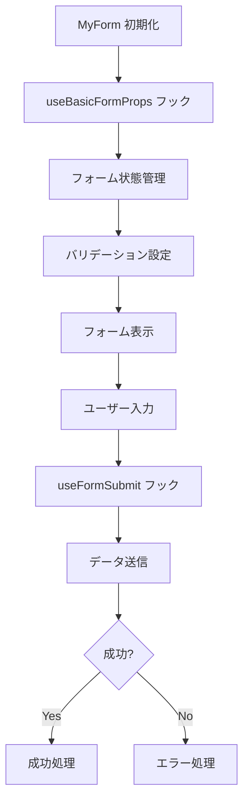

**主要機能:**

- 動的フォーム生成
- バリデーション
- ファイルアップロード
- CRUD操作

## 6. ページ生成・ナビゲーション処理

### 6.1 パス・タイトル管理 (`src/non-common/path-title-constsnts.tsx`)

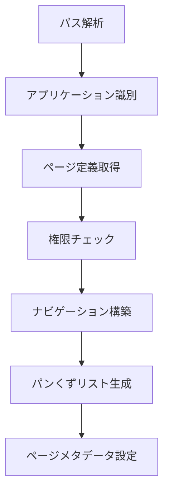

**主要機能:**

- 動的ナビゲーション生成
- パンくずリスト管理
- 権限ベースのページ表示制御
- メタデータ管理

## 7. 状態管理・フック処理

### 7.1 カスタムフック群 (`src/cm/hooks/`)

主要なカスタムフック：

- **useGlobalContext**: グローバル状態管理
- **useBasicForm**: フォーム状態管理
- **useCacheSelectOptions**: 選択肢キャッシュ管理
- **useFileUpload**: ファイルアップロード処理
- **usePageTracking**: ページトラッキング
- **useUserRole**: ユーザーロール管理

### 7.2 状態管理フロー

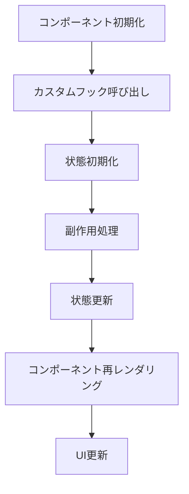

## 8. API処理フロー

### 8.1 API ルート処理 (`src/app/api/`)

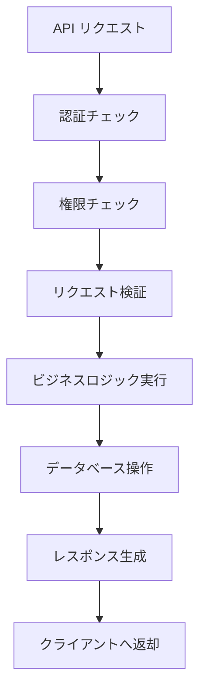

**主要APIカテゴリ:**

- **auth**: 認証関連
- **prisma**: データベース操作
- **google**: Google サービス連携
- **kingOfTime**: 勤怠管理連携
- **openAi**: AI機能

## 9. エラーハンドリング・ログ処理

### 9.1 エラー処理フロー

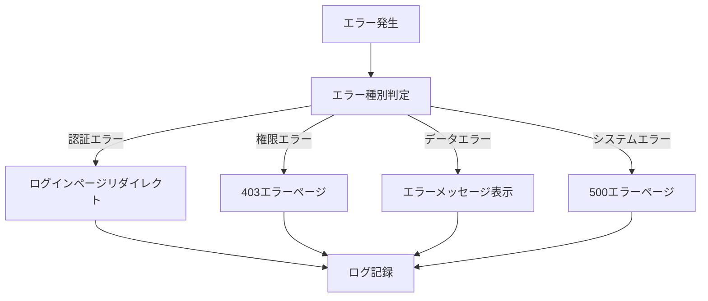

## 10. パフォーマンス最適化

### 10.1 最適化手法

- **メモ化**: React.memo, useMemo, useCallback の活用
- **コード分割**: 動的インポートによる遅延読み込み
- **キャッシュ**: データキャッシュとクエリ最適化
- **無限スクロール**: 大量データの効率的表示

### 10.2 最適化フロー

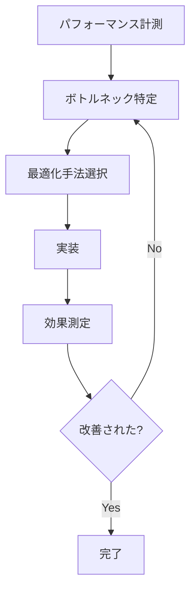

## 11. セキュリティ対策

### 11.1 セキュリティレイヤー

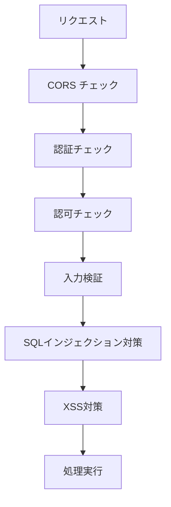

**主要セキュリティ機能:**

- JWT トークンベース認証
- ロールベースアクセス制御
- CORS 設定
- 入力検証・サニタイゼーション
- Prisma による SQL インジェクション対策

## 12. まとめ

本プロジェクトは以下の特徴を持つ堅牢なWebアプリケーションです：

1. **モジュラー設計**: 共通処理とアプリ固有処理の明確な分離
2. **型安全性**: TypeScript による厳密な型管理
3. **パフォーマンス**: メモ化と最適化による高速化
4. **セキュリティ**: 多層防御によるセキュリティ確保
5. **拡張性**: 新しいアプリケーションの容易な追加
6. **保守性**: 明確な責務分離と再利用可能なコンポーネント

この設計により、複数のアプリケーションを効率的に管理し、高品質なユーザー体験を提供しています。
